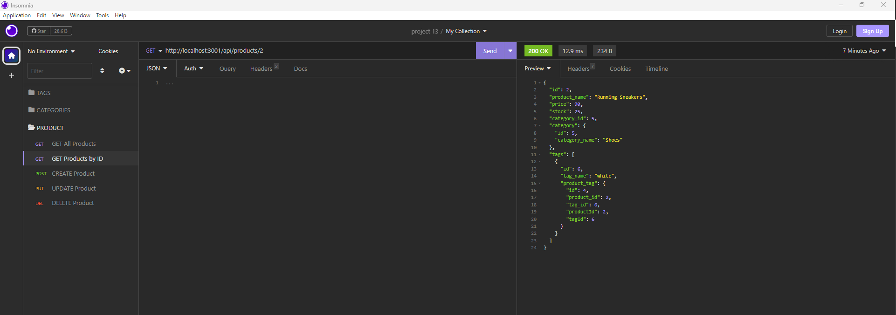
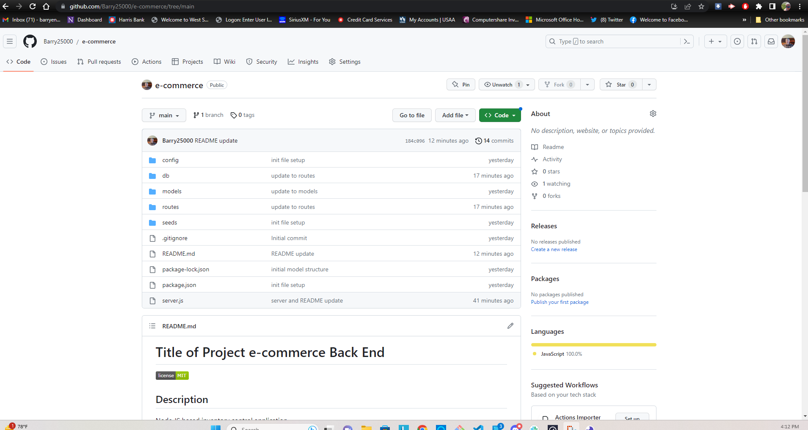

# Title of Project e-commerce Back End

## Description

Node JS based inventory control application.

## Table of Contents

- [Installation](#installation)

- [Usage](#usage)

- [License](#license)

- [Contributing](#contributing)

- [Tests](#tests)

- [Questions](#questions)

## Installation

To install necessary dependencies, run the following command:  
npm i in the terminal  
Run mysql, install the db, as well as seed the db using node JS command "node seeds/index.js" 
To run the application, run nodemon server in your terminal and use Insomnia to emulate your browser, using the routes. 

## Usage

To keep track of a stores inventory

## License

This project is licensed under.  
MIT
https://opensource.org/license/MIT/

## Contributing

Barry Engler and my Tutor Nathan Engler

## Tests

To run tests, run the following command:  
There are no tests at this time.

## Questions

Please direct any questions to. 
barryengler@gmail.com  
[GitHub](https://github.com/Barry250000)

## Video Link

Video Link https://drive.google.com/file/d/157XbEoXs_duiesFZRfN-RA07tkGGAhuQ/view

## Screen Shots

